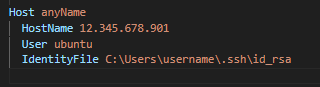

# Ubuntu Server Setup

## Table of Contents

- [Ubuntu Server Setup](#ubuntu-server-setup)
  - [Table of Contents](#table-of-contents)
  - [Initial Server Setup (Not Required for Linneaus CSCloud Servers)](#initial-server-setup-not-required-for-linneaus-cscloud-servers)
    - [Create a New User](#create-a-new-user)
    - [Grant Administrative Privileges](#grant-administrative-privileges)
    - [Set Up Basic Firewall](#set-up-basic-firewall)
    - [Enable External Access for Your Regular User](#enable-external-access-for-your-regular-user)
  - [Install Software](#install-software)
    - [Update and Upgrade System Packages](#update-and-upgrade-system-packages)
  - [Setup Node Web Server (START HERE FOR LINNEAUS CSCloud SETUP)](#setup-node-web-server-start-here-for-linneaus-cscloud-setup)
    - [Login to the server](#login-to-the-server)
    - [Update and Upgrade System Packages](#update-and-upgrade-system-packages-1)
    - [Install Node.js](#install-nodejs)
    - [Install PM2](#install-pm2)
    - [Install Nginx](#install-nginx)
    - [Configure Nginx](#configure-nginx)
    - [Setup SSL with Cerbot](#setup-ssl-with-cerbot)
    - [Update HTTP v1.1 to v2](#update-http-v11-to-v2)
  - [Connect to the Server via VsCode](#connect-to-the-server-via-vscode)
  - [Add and run an application (LAST STEP FOR LINNEAUS CSCloud SETUP)](#add-and-run-an-application-last-step-for-linneaus-cscloud-setup)
  - [Configure Nginx for Next.js](#configure-nginx-for-nextjs)

<br>

## Initial Server Setup (Not Required for Linneaus CSCloud Servers)

### Create a New User

1. Log in to your server as the root user.

```sh
ssh root@server_ip_address
```

<br>

2. Use the `adduser` command to add a new user to your system. Replace `username` with the user you want to create:

```sh
adduser username
```

<br>

Follow the prompts to set a password and information for the new user. It is fine to press `ENTER` through all of the prompts.

<br>

### Grant Administrative Privileges

Use the `usermod` command to add the user to the `sudo` group. Replace `username` with the user you created in the previous step:

```sh
usermod -aG sudo username
```

<br>

### Set Up Basic Firewall

Ubuntu servers can use the `ufw` firewall to make sure only connections to certain services are allowed. We can set up a basic firewall very easily using this application.

First you can check the list of UFW application profiles by typing:

```sh
ufw app list
```

```sh
#Output
Available applications:
  OpenSSH
```

<br>

You can allow OpenSSH (SSH) connections through the firewall. This is important because if you deny SSH access, you will lock yourself out of your server. Enable SSH access by typing:

```sh
ufw allow OpenSSH
```

<br>

Now that you have the firewall configured to allow SSH connections, you can enable it.

```sh
ufw enable
```

<br>

You can check the status of the firewall by typing:

```sh
ufw status
```

```sh
#Output
Status: active

To                         Action      From
--                         ------      ----
OpenSSH                    ALLOW       Anywhere
OpenSSH (v6)               ALLOW       Anywhere (v6)
```

<br>

### Enable External Access for Your Regular User

When you initially created your user, you were assigned a unique SSH key. You can copy this key to your new user so that you can log in as them using the same key.

To do this you can use the `rsync` command to copy the `.ssh` directory from the root user's home directory to your new user's home directory. This will copy all of your root user's keys to the new user.

```sh
rsync --archive --chown=username:username ~/.ssh /home/username
```

<br>

Now you should be able to SSH into your server as your new user:

```sh
ssh username@server_ip_address
```

<br>

## Install Software

### Update and Upgrade System Packages

Before you install any software, it's always recommended to update and upgrade system packages. SSH into your server as your regular user and run the following commands:

```sh
sudo apt update
sudo apt upgrade
```

<br>

> [!NOTE]
> If you choose to use a password when creating your regular user you will need to use `sudo` for some commands.

<br>

---

<br>

## Setup Node Web Server (START HERE FOR LINNEAUS CSCloud SETUP)

> [!NOTE]
> This section is for setting up a Node.js web server with Nginx as a reverse proxy, pm2 as a process manager, and SSL with Let's Encrypt. **This is the setup to follow for Linneaus CSCloud servers.**

<br>

### Login to the server

**Your first time logging in?**

> [!IMPORTANT]
> You will need to reference the specific key you want to use:
>
> `C:\Users\username\.ssh\your-key-name` - The path to your private key, replace `username` with the name of your user and `your-key-name` with the name of your key.
>
> second `username` - The name of your user on the server (should be `ubuntu` on Linneaus CSCloud servers).
>
> `server_ip_address` - The IP address of your server.

<br>

```sh
ssh -i C:\Users\username\.ssh\your-key-name username@server_ip_address
```

<br>

**Already logged in once like above?**

Then you should need to reference the key again. Instead you can use the following command in the future:

```sh
ssh username@server_ip_address
```

<br>

**Having trouble logging in?**

If you are having trouble logging in, you can try the following command to see what is going wrong:

<br>

Check if your ssh-agent is running:

```sh
ssh-agent -s
```

<br>

If it is running, nothing will happen. You can then try to add your key to the ssh-agent:

```sh
ssh-add C:\Users\username\.ssh\id_rsa # Replace with the exact path to YOUR private key
```

<br>

If you get an error, you need to activate the ssh-agent and add your key to it:

<br>

**For Windows (Powershell):**

Step 1 - Open Powershell as an administrator

<br>

Step 2 - Set the ssh-agent service to start automatically and start the service

```powershell
Set-Service ssh-agent -StartupType Automatic
Start-Service ssh-agent
```

<br>

Step 3 - Verify that the service is running

```powershell
Get-Service ssh-agent
```

<br>

Step 4 - Add your key to the ssh-agent

```powershell
ssh-add C:\Users\username\.ssh\your-key-name # Replace with the exact path to YOUR private key
```

<br>

---

<br>

**For MacOS (Bash/Zsh):**

Step 1 - Start the ssh-agent

```sh
eval "$(ssh-agent -s)"
```

<br>

Step 2 - Make sure the .ssh directory has the correct permissions

```sh
chmod 700 ~/.ssh
```

<br>

Step 3 - Create and edit the config file

```sh
nano ~/.ssh/config # Open the config file
```

<br>

Add the following lines to the config file:

```sh
AddKeysToAgent yes
UseKeychain yes
```

<br>

Step 4 - Add your key to the ssh-agent

```sh
ssh-add --apple-use-keychain ~/.ssh/your-key-name # Replace with the exact path to YOUR private key
```

<br>

Step 5 - Verify that the key was added

```sh
ssh-add -l
```

<br>

### Update and Upgrade System Packages

> [!NOTE]
> When logged into the server the first step is to update and upgrade the system packages.

```sh
sudo apt update
sudo apt upgrade
```

<br>

### Install Node.js

To install Node.js, you will need to be in your home directory. You can get there by typing:

```sh
cd ~
```

<br>

Before you begin, ensure that curl is installed on your system. If curl is not installed, you can install it using the following command:

```sh
sudo apt-get install -y curl
```

<br>

1. **Download the setup script:**

   ```sh
   curl -fsSL https://deb.nodesource.com/setup_22.x -o nodesource_setup.sh
   ```

2. **Run the setup script with sudo:**

   ```sh
   sudo -E bash nodesource_setup.sh
   ```

3. **Install Node.js:**

   ```sh
   sudo apt-get install -y nodejs
   ```

   **Verify the installation:**

   ```sh
   node -v
   npm -v
   ```

   ```sh
    #Example Output
    v22.10.0
    10.2.3
   ```

<br>

### Install PM2

PM2 is a process manager for Node.js applications. With PM2, you can keep applications alive forever, reload them without downtime, and easily manage application logs.

**Install PM2:**

```sh
sudo npm install -g pm2
```

<br>

> [!NOTE]
> Later in this guide, you will use PM2 to start your Node.js application.

<br>

### Install Nginx

Nginx is a high-performance web server that is used to serve static content, reverse proxy, and load balance among other things.

**Step 1 - Install Nginx:**

```sh
sudo apt install nginx
```

<br>

**Step 2 - Adjust the Firewall (Skip this step for Linneaus CSCloud servers, go to step 3):**

> [!CAUTION]
> Firewall adjusting is not required for Linneaus CSCloud servers. The firewall is already configured and you do not have access to it.

<br>

If you've followed the initial server setup guide, you should have a UFW firewall enabled. Nginx registers itself with UFW upon installation, so you can allow Nginx traffic by enabling the Nginx profile:

List the application configurations that ufw knows how to work with by typing:

```sh
sudo ufw app list
```

<br>

You should get a listing of the application profiles:

```sh
#Output
Available applications:
  Nginx Full
  Nginx HTTP
  Nginx HTTPS
  OpenSSH
```

<br>

As demonstrated by the output, there are three profiles available for Nginx:

- Nginx Full: This profile opens both port 80 (normal, unencrypted web traffic) and port 443 (TLS/SSL encrypted traffic)
- Nginx HTTP: This profile opens only port 80 (normal, unencrypted web traffic)
- Nginx HTTPS: This profile opens only port 443 (TLS/SSL encrypted traffic)

<br>

It is recommended that you enable the most restrictive profile that will still allow the traffic you’ve configured. Right now, we will only need to allow traffic on port 80.

<br>

You can enable this by typing:

```sh
sudo ufw allow 'Nginx HTTP'
```

<br>

You can verify the change by typing:

```sh
sudo ufw status
```

<br>

You should see HTTP traffic allowed in the displayed output:

```sh
#Output
Status: active

To                         Action      From
--                         ------      ----
OpenSSH                    ALLOW       Anywhere
Nginx HTTP                 ALLOW       Anywhere
OpenSSH (v6)               ALLOW       Anywhere (v6)
Nginx HTTP (v6)            ALLOW       Anywhere (v6)
```

<br>

**Step 3 - Check the Web Server**

At the end of the installation process, Ubuntu starts Nginx. The web server should already be up and running.

You can check with the `systemctl` command:

```sh
sudo systemctl status nginx
```

<br>

You should see output similar to the following:

```sh
#Output
● nginx.service - A high-performance web server and a reverse proxy server
    Loaded: loaded (/lib/systemd/system/nginx.service; enabled; vendor preset: enabled)
    Active: active (running) since Mon 2022-03-14 20:00:00 UTC; 24h ago
      Docs: man:nginx(8)
  Main PID: 2369 (nginx)
    Tasks: 2 (limit: 1153)
    Memory: 3.5M
    CGroup: /system.slice/nginx.service
            ├─2369 nginx: master process /usr/sbin/nginx -g daemon on; master_process on;
            └─2380 nginx: worker process
```

<br>

> [!TIP]
> You can access the default Nginx landing page to confirm that the software is running properly by navigating to your server’s IP address or domain name if you have added a domain. If you do not know your server’s IP address, you can find it by using the icanhazip.com tool, which will give you your public IP address as received from another location on the internet:
>
> **Linneaus students can find their server's Domain Name and IP Address on GitLab.**

```sh
curl -4 icanhazip.com
```

<br>

After you have your server’s IP address, enter it into your web browser’s address bar:

```sh
http://your_server_ip # IP address or domain name
```

<br>

You will see the default Nginx landing page:


<br>

**Commands to Manage the Nginx Process**

Now that Nginx is installed and running, you can interact with it using the `systemctl` command.

<br>

> [!TIP]
> The following commands do not need to be used now but are useful for managing the Nginx process in the future.
>
> For example, if you make configuration changes to Nginx, you will need to restart the Nginx process to apply the changes.

<br>

To stop your web server, you can type:

```sh
sudo systemctl stop nginx
```

<br>

To start the web server when it is stopped, type:

```sh
sudo systemctl start nginx
```

<br>

To stop and then start the service again, type:

```sh
sudo systemctl restart nginx
```

<br>

If you are simply making configuration changes, Nginx can often reload without dropping connections. To do this, this command can be used:

```sh
sudo systemctl reload nginx
```

<br>

By default, Nginx is configured to start automatically when the server boots. If this is not what you want, you can disable this behavior by typing:

```sh
sudo systemctl disable nginx
```

<br>

To re-enable the service to start up at boot, you can type:

```sh
sudo systemctl enable nginx
```

<br>

### Configure Nginx

> [!CAUTION]
> When configuring NGINX for production, you should always turn of information that the server leaks. Do:
>
> Install nano for easier file editing (optional but recommended):
>
> ```sh
> sudo apt-get install nano
> ```
>
> Open the NGINX config file:
>
> ```sh
> sudo nano /etc/nginx/nginx.conf
> ```
>
> Remove the # in front of "server_tokens off;":
>
> ```sh
> server_tokens off;
> ```
>
> Save and exit the file. Restart NGINX:
>
> ```
> sudo systemctl restart nginx.service
> ```

<br>

**Useful paths**

- /etc/nginx/nginx.conf - Location of global config file
- /etc/nginx/sites-available - Directory for config files

<br>

**Create config file**

Go to the `/etc/nginx/sites-available` directory and create a new config file for your server:

```sh
cd /etc/nginx/sites-available
sudo nano cscloudX-XX.lnu.se # Replace cscloudX-XX.lnu.se with your domain name
```

<br>

Create a symbolic link in the `/etc/nginx/sites-enabled` directory that points to the config file you just created in the `/etc/nginx/sites-available` directory:

```sh
sudo ln -s /etc/nginx/sites-available/cscloudX-XX.lnu.se /etc/nginx/sites-enabled/ # Replace cscloudX-XX.lnu.se with your domain name
```

<br>

**Remove the default file**

Remove the default file in the `/etc/nginx/sites-available` directory:

```sh
cd /etc/nginx/sites-available
sudo rm default
```

<br>

Remove the symbolic link to the default file in the `/etc/nginx/sites-enabled` directory:

```sh
cd /etc/nginx/sites-enabled
sudo rm default
```

<br>

**Populate the config file you created in "sites-available"**

Go into the config file you just created:

```sh
sudo nano /etc/nginx/sites-available/cscloudX-XX.lnu.se # Replace cscloudX-XX.lnu.se with your domain name
```

<br>

Add the following configuration to the file (replace `cscloudX-XX.lnu.se` with your domain name):

```nginx
server {
        server_name cscloudX-XX.lnu.se; # This is the server name, it should match your domain name
        index index.html index.htm index.nginx-debian.html;

        root /var/www/html;

        location / { # This is the location block, it tells Nginx how to handle requests to the server
                try_files $uri $uri/ =404;
        }
}
```

<br>

**Add other routes to config file**

If you have other routes in your application, you can add them to the config file like this:

```nginx
server {
        server_name cscloudX-XX.lnu.se; # This is the server name, it should match your domain name
        index index.html index.htm index.nginx-debian.html;

        root /var/www/html;

        location / { # This is the root location block
                try_files $uri $uri/ =404;
        }

        location /crud-app/ { # This is the location block for the /crud-app route
                proxy_pass http://localhost:3001/; # This will pass requests to the /crud-app route to port 3001
                proxy_http_version 1.1;
                proxy_set_header Upgrade             $http_upgrade;
                proxy_set_header Connection          'upgrade';

                proxy_set_header Host                 $host;
                proxy_set_header X-Real-IP            $remote_addr;
                proxy_set_header X-Forwarded-For      $proxy_add_x_forwarded_for;
                proxy_set_header X-Forwarded-Proto    $scheme;
                proxy_set_header X-Forwarded-Host     $host;
                proxy_set_header X-Forwarded-Port     $server_port;
        }
}
```

<br>

### Setup SSL with Cerbot

**Step 1 - Install Snapd:**

```sh
sudo apt install snapd
```

<br>

**Step 2 - Install Certbot:**

```sh
sudo snap install --classic certbot
```

<br>

**Step 3 - Prepare the Certbot command:**

```sh
sudo ln -s /snap/bin/certbot /usr/bin/certbot
```

<br>

**Step 4 - Get and install the SSL certificate:**

```sh
sudo certbot --nginx
```

<br>

> [!NOTE]
> Follow the prompts to install the SSL certificate.
>
> You will need to choose the domain name to install the certificate on or enter it manually.
>
> For Linneaus CSCloud servers, you will need to enter the domain name you were given on GitLab.
>
> You will also have to enter your email address and agree to the terms of service.

<br>

**Step 5 - Test the automatic renewal:**

```sh
sudo certbot renew --dry-run
```

<br>
 
**Step 6 - Confirm the SSL certificate is working:**

Navigate to your domain in a web browser and confirm that the SSL certificate is working. You should see a padlock icon in the address bar and the connection should start with `https://`.

<br>

**This is how the file should look after installing the SSL certificate:**

Display it with the following command:

```sh
cat /etc/nginx/sites-available/cscloudX-XX.lnu.se # Replace cscloudX-XX.lnu.se with your domain name
```

<br>

```nginx
# Output
server {
        server_name cscloudX-XX.lnu.se; # This is the server name, it should match your domain name
        index index.html index.htm index.nginx-debian.html;

        root /var/www/html;

        location / { # This is the root location block
                try_files $uri $uri/ =404;
        }

        location /crud-app/ { # This is the location block for the /crud-app route
                proxy_pass http://localhost:3001/; # This will pass requests to the /crud-app route to port 3001
                proxy_http_version 1.1;
                proxy_set_header Upgrade             $http_upgrade;
                proxy_set_header Connection          'upgrade';

                proxy_set_header Host                 $host;
                proxy_set_header X-Real-IP            $remote_addr;
                proxy_set_header X-Forwarded-For      $proxy_add_x_forwarded_for;
                proxy_set_header X-Forwarded-Proto    $scheme;
                proxy_set_header X-Forwarded-Host     $host;
                proxy_set_header X-Forwarded-Port     $server_port;
        }


    listen 443 ssl; # managed by Certbot
    ssl_certificate /etc/letsencrypt/live/cscloudX-XX.lnu.se/fullchain.pem; # managed by Certbot
    ssl_certificate_key /etc/letsencrypt/live/cscloudX-XX.lnu.se/privkey.pem; # managed by Certbot
    include /etc/letsencrypt/options-ssl-nginx.conf; # managed by Certbot
    ssl_dhparam /etc/letsencrypt/ssl-dhparams.pem; # managed by Certbot

}
server {
    if ($host = cscloudX-XX.lnu.se) {
        return 301 https://$host$request_uri;
    } # managed by Certbot


        server_name cscloudX-XX.lnu.se;
    listen 80;
    return 404; # managed by Certbot
}
```

<br>

> [!NOTE]
> All parts of the file that are managed by Certbot are marked with a comment. These parts should not be edited manually.
>
> The one exception is when adding **HTTP v2** support, which is covered in the next section.

<br>

### Update HTTP v1.1 to v2

**Step 1 - Open the sites-available config file:**

```sh
sudo nano /etc/nginx/sites-available/cscloudX-XX.lnu.se # Replace cscloudX-XX.lnu.se with your domain name
```

<br>

**Step 2 - Add the following line to the config file:**

> [!NOTE]
> Refer to the previous section for the full config file.

<br>

Add the line `http2` to the `listen 443 ssl;` block:

```nginx
  # Before
  listen 443 ssl; # managed by Certbot

  # After
  listen 443 ssl http2; # managed by Certbot
```

<br>

Example:


<br>

**Save and exit the file.**

<br>

**Step 3 - Restart Nginx:**

```sh
sudo systemctl restart nginx
```

<br>

## Connect to the Server via VsCode

> [!TIP]
> This section is for connecting to your server via VsCode. This is useful for adding and editing files on the server and running commands without needing to SSH into the server via the terminal.

<br>

**Step 1 - Install the Remote - SSH extension pack in VsCode.**

<br>

**Step 2 - Click the "Remote Explorer" icon in the sidebar.**

<br>

**Step 3 - Click the **Settings icon** on the SSH section and then select the `C:\Users\username\.ssh\config` file.**


<br>


<br>

**Step 4 - Configure the file to connect to your server:**

```
Host cscloudX-XX (the name of your server, can be anything)
HostName 12.345.678.901 (ip address)
User ubuntu (the user to log in as)
IdentityFile C:\Users\username\.ssh\id_rsa (the path to your private key)
```

<br>

**Example:**



<br>

**Step 5 - Click the **Connect to Host** button.**


<br>

## Add and run an application (LAST STEP FOR LINNEAUS CSCloud SETUP)

**Step 1 - Connect to the server via VsCode. (Refer to the previous section for instructions.)**

<br>

**Step 2 - Navigate to the `/var/www` directory.**

```sh
cd /var/www
```

<br>

**Step 3 - Create a new directory for your application.**

```sh
sudo mkdir myapp
```

<br>

**Step 4 - Navigate into the new directory.**

```sh
cd myapp
```

<br>

**Step 5 - Change the ownership of the directory to your regular user.**

> [!IMPORTANT]
> If you do not change the ownership of the directory, you will not be able to add or edit files in the directory.

<br>

```sh
sudo chown -R username:username /var/www/myapp # Replace username with the name of your user (most likely ubuntu on Linneaus CSCloud servers)
```

<br>

**Step 6 - Add your application files to the directory.**

Do this by dragging and dropping the files into the directory in VsCode.

<br>

**Step 7 - Install the application dependencies.**

```sh
npm install
```

<br>

**Step 8 - Create a ecosystem.config.cjs file in the root of your application.**

> [!NOTE]
> This file is used by PM2 to start your application. You can configure the file to start your application with the correct environment variables.

```js
module.exports = {
  apps: [
    {
      name: "crud-app", // Name of your application, can be anything
      script: "./src/app.js", // Path to your main application file
      env: {
        NODE_ENV: "production", // Set the environment to production (should always be set to production when deploying publicly)
        PORT: 3000, // Set the port to 3000 (or whatever port your application uses)
        BASE_URL: "/", // Set the base URL

        // Add any other environment variables here
      },
    },
  ],
};
```

<br>

---

> [!IMPORTANT]
> The `PORT` and `BASE_URL` environment variables should be set to match the values in your Nginx config file.

<br>

Example:

```nginx
        location /crud-app/ { # This is the location block for the /crud-app route
                proxy_pass http://localhost:3001/; # This will pass requests to the /crud-app route to port 3001
                proxy_http_version 1.1;
                proxy_set_header Upgrade             $http_upgrade;
                proxy_set_header Connection          'upgrade';

                proxy_set_header Host                 $host;
                proxy_set_header X-Real-IP            $remote_addr;
                proxy_set_header X-Forwarded-For      $proxy_add_x_forwarded_for;
                proxy_set_header X-Forwarded-Proto    $scheme;
                proxy_set_header X-Forwarded-Host     $host;
                proxy_set_header X-Forwarded-Port     $server_port;
        }
```

<br>

```js
module.exports = {
  apps: [
    {
      name: "crud-app",
      script: "./src/app.js",
      env: {
        NODE_ENV: "production",
        PORT: 3001, // Set the port to 3001 to match the Nginx config file
        BASE_URL: "/api/", // Set the base URL to match the Nginx config file

        // Add any other environment variables here
      },
    },
  ],
};
```

<br>

**Step 9 - Start your application with PM2.**

```sh
pm2 start ecosystem.config.cjs
```

<br>

## Configure Nginx for Next.js

**Step 1 - Open the sites-available config file:**

```sh
sudo nano /etc/nginx/sites-available/your-app-name
```

<br>

**Step 2 - Add the following lines to the config file:**

```nginx
        # Enable Gzip compression for faster loading times
        gzip on;
        gzip_proxied any;
        gzip_types application/javascript application/x-javascript text/css text/javascript;
        gzip_comp_level 5;
        gzip_buffers 16 8k;
        gzip_min_length 256;

        # Serve static files from the .next/static directory
        location /_next/static/ {
                alias /var/www/name_of_app/.next/static/;
                expires 365d;
                access_log off;
        }
```

<br>

**Full config file example:**

```nginx
server {
        server_name domainname.com;

        gzip on;
        gzip_proxied any;
        gzip_types application/javascript application/x-javascript text/css text/javascript;
        gzip_comp_level 5;
        gzip_buffers 16 8k;
        gzip_min_length 256;

        location /_next/static/ {
                alias /var/www/name_of_app/.next/static/;
                expires 365d;
                access_log off;
        }

        location / {
                proxy_pass http://localhost:3000/;
                proxy_http_version 1.1;
                proxy_set_header Upgrade             $http_upgrade;
                proxy_set_header Connection          'upgrade';

                proxy_set_header Host                 $host;
                proxy_set_header X-Real-IP            $remote_addr;
                proxy_set_header X-Forwarded-For      $proxy_add_x_forwarded_for;
                proxy_set_header X-Forwarded-Proto    $scheme;
                proxy_set_header X-Forwarded-Host     $host;
                proxy_set_header X-Forwarded-Port     $server_port;
        }

    listen 443 ssl; # managed by Certbot
    ssl_certificate /etc/letsencrypt/live/domainname.com/fullchain.pem; # managed by Certbot
    ssl_certificate_key /etc/letsencrypt/live/domainname.com/privkey.pem; # managed by Certbot
    include /etc/letsencrypt/options-ssl-nginx.conf; # managed by Certbot
    ssl_dhparam /etc/letsencrypt/ssl-dhparams.pem; # managed by Certbot

}
server {
    if ($host = domainname.com) {
        return 301 https://$host$request_uri;
    } # managed by Certbot


        server_name domainname.com;
    listen 80;
    return 404; # managed by Certbot
}
```

<br>

**Save and exit the file.**

<br>

**Step 3 - Restart Nginx and run your application.**

```sh
sudo systemctl restart nginx
pm2 start ecosystem.config.cjs
```
